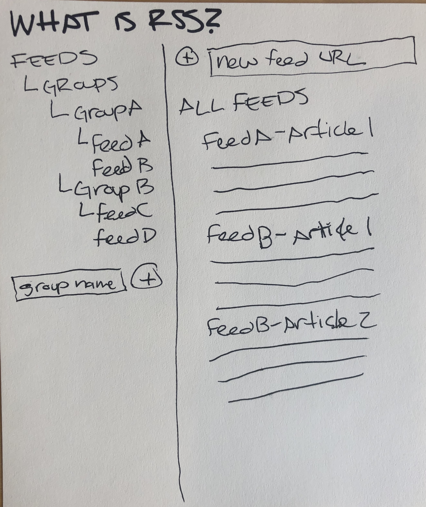
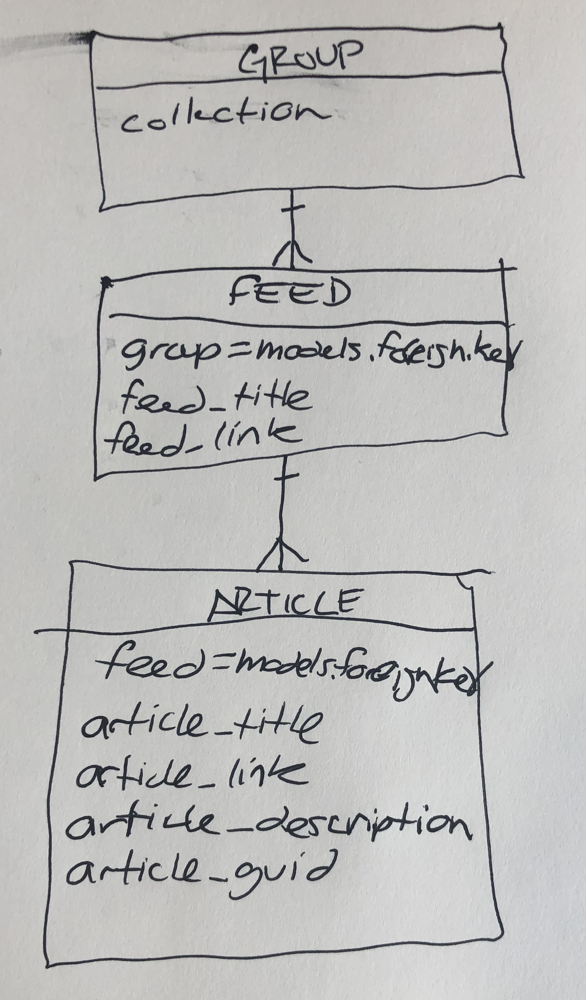

# What is RSS!?

A RSS feed reader for the browser.

## Overview

Real Simple Syndication, or RSS, is a technology first introduced in 1998 to enable the syndication and simple retrieval of any regurlarly updated web content. The most common example of this would be a RSS feed for a blog containing the blog's posts. However, a modern implementation of RSS are Podcasts. Podcasts are distributed and content retrieved, synced and displayed using this "ancient" technology.

This application is a simple reader for RSS feeds. The feed content is saved in a database and a user can retrieve and read all their feeds from the browser. Instead of navigating to numerous different sites to read their latest content a feed reader collects all the websites you check regularly in one place for you to access!

## Technology Used

- HTML 5
- CSS 3
- ReactJS
- Django
- PostgreSQL
- [feedparser](https://pypi.org/project/feedparser/)

## Wireframe, ERD & Trello Board

[Trello board](https://trello.com/b/UFI7y1Rj)

## Next Steps

1. Fix the feedparser to automatically load the 15 most recent articles for each feed.
2. Mark articles as read after they are viewed, provide option to mark as unread as well.
3. Provide a count of unread articles for each feed.
4. Convert the RSS "date published" field into a format suitable for a Django date time field and display the dates of articles.
